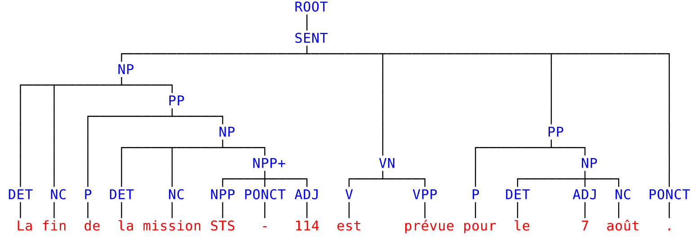

# Syntactic Parsing of Wikipedia

This repository contains scripts for parsing wikipedia (and other wikis)
easily.

It is based on the following tools:

- [mtg parser](https://github.com/mcoavoux/mtg/): outputs constituency
    trees, labelled dependency trees and morphological analyses.
- Benoît Crabbé's [tokenizer](https://github.com/bencrabbe/nlp-toolbox/),
    [forked version](https://github.com/mcoavoux/nlp-toolbox/) for French.
- The tokenizer of the Stanford parser for other languages.
- Giuseppe Attardi's [wikiextractor](https://github.com/attardi/wikiextractor).

The parser is described in Chapter 8 of my dissertation and trained
on the SPMRL dataset [(Seddah et al. 2013)](http://www.aclweb.org/anthology/W13-4917)
and the discontinuous Penn Treebank [(Evang and Kallmeyer, 2011)](http://www.aclweb.org/anthology/W/W11/W11-2913.pdf) for English.

If you use this data in the context of a publication, please cite:

    @phdthesis{coavoux-phd-thesis,
        author = {Coavoux, Maximin},
        school = {Univ Paris Diderot, Sorbonne Paris Cit\'{e}},
        title = {Discontinuous Constituency Parsing of Morphologically Rich Languages},
        year = 2017
    }

# Data

## Download the data

You can download the parsed data at this url: [http://www.llf.cnrs.fr/wikiparse/](http://www.llf.cnrs.fr/wikiparse/).

Here is what is available:

**Language**|**Constituency trees**|**Discontinuous constituency trees**|**Labelled dependency trees**|**POS tags**|**Morphological analysis**
:-----:|:-----:|:-----:|:-----:|:-----:|:-----:
French |X| |X|X|X
English ||X||X|
German ||X||X|X
Basque |X| | |X|X
Polish |X| |X|X|X
Swedish |X| | |X|X
Hungarian |X| | |X|X

## Data description

For each wiki page, we provide two files:

- `ID.txt.tok.conll`: dependency trees in [conll](http://anthology.aclweb.org/W/W06/W06-2920.pdf) format, including morphological analysis.
- `ID.txt.tok.discbracket`: constituency trees in [discbracket](http://discodop.readthedocs.io/en/latest/fileformats.html#discbracket) format.

where `ID` is an identifier for the wiki page.
The wikipedia article corresponding to the file `ID.txt.tok.conll`
is accessible with the URL `https://fr.wikipedia.org/?curid=ID`.
For example, [https://fr.wikipedia.org/?curid=1750](https://fr.wikipedia.org/?curid=1750) yields the article *Linguistique*.
The parse trees for this article are in `1750.txt.tok.conll` and `1750.txt.tok.discbracket`.

The morphological analysis for a token is provided as a set of attribute-value couples (see conll example below).
The attributes include:

- French:  gender (g), number (n), tense (t), mood (m), subcategory (s), person (p), multiword expression (mwehead and pred).
- German: case, number, gender, degree, tense, mood, person.

See the documentation of the SPMRL dataset release for more information about morphological annotations.

### Examples

Discbracket tree:

    (ROOT (SENT (NP (DET 0=La) (NC 1=fin)  (PP (P 2=de (NP (DET 3=la) (NC 4=mission) (NPP+ (NPP 5=STS) (PONCT 6=-) (ADJ 7=114)))))) (VN (V 8=est) (VPP 9=prévue)) (PP (P 10=pour) (NP (DET 11=le) (ADJ 12=7) (NC 13=août))) (PONCT 14=.)))

Corresponding constituency tree (drawn with [discodop](https://github.com/andreasvc/disco-dop/)):

Conll tree:

    1	La	_	DET	DET	g=f|n=s|s=def	2	det	_	_
    2	fin	_	NC	NC	g=f|n=s|s=c	10	suj	_	_
    3	de	_	P	P	_	2	dep	_	_
    4	la	_	DET	DET	g=f|n=s|s=def	5	det	_	_
    5	mission	_	NC	NC	g=f|n=s|s=c	3	obj.p	_	_
    6	STS	_	NPP	NPP	mwehead=NPP+|s=p|pred=y	5	mod	_	_
    7	-	_	PONCT	PONCT	s=w|pred=y	6	dep_cpd	_	_
    8	114	_	ADJ	ADJ	g=f|s=card|pred=y	6	dep_cpd	_	_
    9	est	_	V	V	m=ind|n=s|p=3|t=pst	10	aux.pass	_	_
    10	prévue	_	VPP	VPP	g=f|m=part|n=s|t=past	0	root	_	_
    11	pour	_	P	P	_	10	mod	_	_
    12	le	_	DET	DET	g=m|n=s|s=def	14	det	_	_
    13	7	_	ADJ	ADJ	g=m|n=s|s=card	14	mod	_	_
    14	août	_	NC	NC	g=m|n=s|s=c	11	obj.p	_	_
    15	.	_	PONCT	PONCT	s=s	10	ponct	_	_

Corresponding dependency tree (drawn with [ginger](https://github.com/LoicGrobol/ginger/)):

## Some stats (wikipedia only)

|Langage|Number of articles|Number of sentences|Number of tokens|
|:----|---:|---:|---:|
|English|5,490,659|210,149,524|3,641,031,044|
|Basque|284,192|3,423,803|53,630,159|
|German|2,109,141|72,803,332|1,225,851,095|
|French|1,917,621|48,675,094|1,303,811,180|
|Hungarian|418,216|12,962,605|178,171,115|
|Polish|1,244,308|27,580,861|393,371,595|
|Swedish|3,789,290|32,218,499|500,037,343|

# Reparse

## Setup

Instructions for downloading and compiling these tools are in `setup.sh`.
To run it, you need boost, g++, clang++ and java8 (for the Stanford parser).

## Source Data

The scripts need cirrus dumps as input, found at [https://dumps.wikimedia.org/other/cirrussearch/](https://dumps.wikimedia.org/other/cirrussearch/).

To download and extract the data for a specific language, run:

    bash download_extract_lang.sh <date> <language code>

where `date` is the time stamp for a wikipedia dump (see what is available
[here](https://dumps.wikimedia.org/other/cirrussearch/))
and language code is the identifier used by wikipedia for the language.

For example:

    bash download_extract_lang.sh 20171009 fr # download French wiki dump of 9 october 2017
    bash download_extract_lang.sh 20171009 ko # download Korean wiki

## Parse

Use the script `parse_wiki.py` to parse the data.

    python3 parse_wiki.py --help
    # python3 parse_wiki.py <parser exe> <parsing model> <path to tokenizer> <wiki root>--threads <num of threads> --beam <size of beam>
    
    python3 parse_wiki.py ./mtg2_parser FRENCH ./tokenizer_fr extracted_texts/frwiki --threads 20
    # or
    python3 parse_wiki.py "./mtg2_parser -p " FRENCH ./tokenizer_fr extracted_texts/frwiki --threads 20

The `-p` option precomputes and caches character-based word embeddings
(higher initialization time but faster parsing).

For French, each thread should take less than 1 Go of memory.

Pipeline:

1. Print each article in `<ID>.txt`, where ID is an identifier for the
  article (ex: [`https://fr.wikisource.org/?curid=1026462`](https://fr.wikisource.org/?curid=1026462) yields
  the wikisource page for *Du côté de chez Swann*).
2. Call the tokenizer (sentence segmentation, tokenization) and do
  some preprocessing to match the input format of the parser
  (essentially, replace parentheses by `-LRB-` / `-RRB-`).
  This outputs `<ID>.txt.tok` for each `<ID>.txt` file.
3. Call the parser. The parser outputs:
    - `<ID>.txt.conll`: a conll file containing labelled dependency trees
      and morphological analyses.
    - `<ID>.txt.discbracket`: a [discbracket](http://discodop.readthedocs.io/en/latest/fileformats.html#discbracket)
      file containing a constituency tree.

# References

- Maximin Coavoux. *Discontinuous Constituency Parsing of Morphologically Rich Languages.* PhD dissertation, Université Paris Diderot, Université Sorbonne Paris Cité (USPC), 2017. [[bib]](https://raw.githubusercontent.com/mcoavoux/wiki_parse/master/phd.bib)

